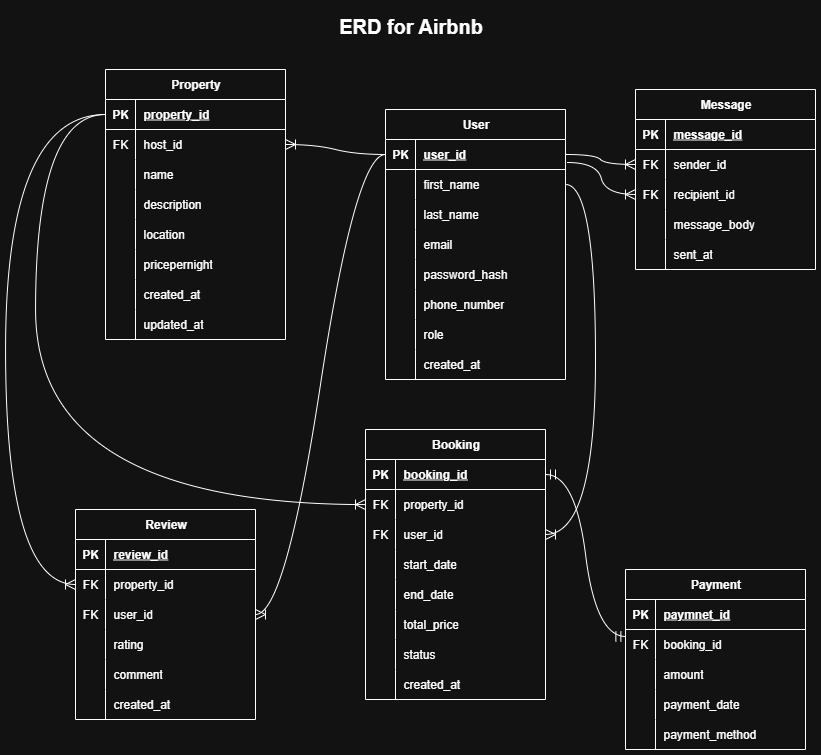

# Airbnb Database ERD Requirements

## Entities and Attributes

### 1. User

- `user_id` (PK)
- `first_name`
- `last_name`
- `email` (Unique)
- `password_hash`
- `phone_number`
- `role` (ENUM: guest, host, admin)
- `created_at`

### 2. Property

- `property_id` (PK)
- `host_id` (FK → User.user_id)
- `name`
- `description`
- `location`
- `price_per_night`
- `created_at`
- `updated_at`

### 3. Booking

- `booking_id` (PK)
- `property_id` (FK → Property.property_id)
- `user_id` (FK → User.user_id)
- `start_date`
- `end_date`
- `total_price`
- `status` (ENUM: pending, confirmed, cancelled)
- `created_at`

### 4. Payment

- `payment_id` (PK)
- `booking_id` (FK → Booking.booking_id)
- `amount`
- `payment_date`
- `paypayment_method` (ENUM: credit_card, paypal, stripe)

### 5. Review

- `review_id` (PK)
- `property_id` (FK → Property.property_id)
- `user_id` (FK → User.user_id)
- `rating` (1-5)
- `comment`
- `created_at`

### 6. Message

- `message_id` (PK)
- `sender_id` (FK → User.user_id)
- `recipient_id` (FK → User.user_id)
- `message_body`
- `sent_at`

---

## Relationships

1. User ↔ Property

Relationship: A host (User) can list multiple properties.

Type: 1:M

Foreign Key: Property.host_id → User.user_id

Meaning:

One host owns many properties.

A property belongs to exactly one host.

2. User ↔ Booking

Relationship: A guest (User) can make multiple bookings.

Type: 1:M

Foreign Key: Booking.user_id → User.user_id

Meaning:

One guest can create many bookings.

Each booking belongs to exactly one guest.

3. Property ↔ Booking

Relationship: A property can have multiple bookings over time.

Type: 1:M

Foreign Key: Booking.property_id → Property.property_id

Meaning:

One property can be booked multiple times by different guests.

Each booking is tied to exactly one property.

4. Booking ↔ Payment

Relationship: Each booking must have exactly one payment.

Type: 1:1

Foreign Key: Payment.booking_id → Booking.booking_id

Meaning:

A booking cannot have multiple payments.

A payment belongs to one booking only.

5. User ↔ Review ↔ Property

This is a many-to-many relationship resolved using the Review table.

Between User and Review:
1:M → Review.user_id → User.user_id

A user can write many reviews, but each review is by one user.

Between Property and Review:
1:M → Review.property_id → Property.property_id

A property can have many reviews, but each review is for one property.

Final Interpretation:
Many users can review many properties, but each review connects one user and one property.

6. User ↔ Message (Self-Referential)

Relationship: Users can send messages to other users.

Type: 1:M (twice, self-referencing)

Foreign Keys:

Message.sender_id → User.user_id

Message.recipient_id → User.user_id

Meaning:

One user can send many messages.

Each message has exactly one sender and one recipient.
---

## ERD Diagram

Below is the ERD diagram:

